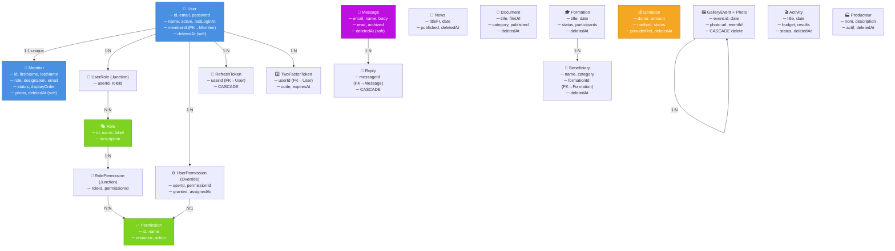

# 🎯 RÉSUMÉ EXÉCUTIF - AUDIT PHASE 0 REKOMA

## 📊 DASHBOARD AUDIT

```
┌─────────────────────────────────────────────────────────────────┐
│  STATUT GLOBAL DE LA BASE DE DONNÉES & SCHÉMA PRISMA            │
├─────────────────────────────────────────────────────────────────┤
│                                                                  │
│  ✅ Schéma Syntaxiquement Valide                                │
│  ✅ 4 Migrations Appliquées Avec Succès                         │
│  ✅ 16 Modèles Présents & Synchro                               │
│  ⚠️  Problèmes Identifiés : 8                                   │
│  🔴 Critiques : 2                                               │
│  🟡 Élevés : 5                                                  │
│  🟢 Mineurs : 1                                                 │
│                                                                  │
│  Status: ACCEPTABLE avec CORRECTIONS URGENTES                  │
└─────────────────────────────────────────────────────────────────┘
```

---

## 🔍 FINDINGS PAR CATÉGORIE

### ✅ CE QUI FONCTIONNE BIEN

| # | Domaine | Constat | Impact |
|----|---------|---------|--------|
| 1 | **Migrations** | Ordre d'exécution cohérent, aucun conflit | 🟢 Stable |
| 2 | **Clés Primaires** | Tous les modèles utilisent CUID (unique) | 🟢 Secure |
| 3 | **Relations 1:1** | User.memberId avec UNIQUE constraint | 🟢 Clean |
| 4 | **Relations 1:N** | FK avec ON DELETE/UPDATE appropriés | 🟢 Clean |
| 5 | **Soft-Delete** | Implémenté sur 11/16 modèles critiques | 🟡 Acceptable |
| 6 | **Indices** | Indices créés pour recherche auth & payment | 🟢 Good |

### ⚠️ PROBLÈMES IDENTIFIÉS

| Sévérité | # | Problème | Ligne/Zone | Correction |
|----------|---|---------|---------|-----------|
| 🔴 **CRITIQUE** | P1 | **RBAC Manquant** : Pas de tables Role, Permission, RolePermission | Schema entier | Migration 5 : créer 4 tables N:N |
| 🔴 **CRITIQUE** | P2 | **User sans Soft-Delete** : Risque perte données | User model | Migration 5 : `ADD User.deletedAt` |
| 🟡 **ÉLEVÉ** | P3 | **Timestamps Inconsistants** : CMS/Formation TIMESTAMP(3) vs TIMESTAMPTZ(6) | News, Document, Formation, Activity, GalleryEvent | Migration 5 : ALTER TYPE |
| 🟡 **ÉLEVÉ** | P4 | **Indices Manquants** : User.email, User.memberId, Member.status | User, Member | Migration 5 : CREATE INDEX (4 indices) |
| 🟡 **ÉLEVÉ** | P5 | **Beneficiary sans Soft-Delete** | Beneficiary model | Migration 5 : `ADD Beneficiary.deletedAt` |
| 🟡 **ÉLEVÉ** | P6 | **Producteur sans Soft-Delete** | Producteur model | Migration 5 : `ADD Producteur.deletedAt` |
| 🟡 **ÉLEVÉ** | P7 | **User.permissions JSON** : Fragile, non-auditable | User.permissions | Migration 5 : remplacer par UserPermission table |
| 🟡 **MOYEN** | P8 | **Member.email pas @unique** : Duplication possible | Member.email | Considérer pour futur |

---

## 📈 MATRICE IMPACT

```
          ╔════════════════════════════════════════════════╗
          ║  SÉVÉRITÉ vs EFFORT DE CORRECTION              ║
          ╠════════════════════════════════════════════════╣
          ║                                                ║
          ║  CRITIQUE       │  Data Loss Risk   → Migration 5 urgente
          ║  CRITIQUE       │  RBAC absent      → Foundation pour PHASE 1
          ║                 │                   │
          ║  ÉLEVÉ          │  Timestamps       → Type conversion (safe)
          ║  ÉLEVÉ          │  Indices          → CREATE INDEX (instant)
          ║  ÉLEVÉ          │  Soft-Delete      → ADD columns (safe)
          ║                 │                   │
          ║  MOYEN          │  Email unique     → Future refine
          ║                                      │
          ║  ◄──── EFFORT ──────────────────► │
          ║                  ÉLEVÉ  ↓
          ║
          ╚════════════════════════════════════════════════╝
```

---

## 🛠️ PLAN CORRECTION (MIGRATION 5)

### Étapes Séquentielles

```
┌─────────────────────────────────────────────────────────────────┐
│  MIGRATION 5 : audit_fixes_rbac                                  │
│  Fichier : prisma/migrations/20260813090000_audit_fixes_rbac    │
└─────────────────────────────────────────────────────────────────┘

   STEP 1: Soft-Delete Columns (SAFE - Additive)
   ├─ ALTER "User" ADD "deletedAt"
   ├─ ALTER "Beneficiary" ADD "deletedAt"
   └─ ALTER "Producteur" ADD "deletedAt"
      ✓ Impact: 0 data loss, 100% backward compatible

   STEP 2: Performance Indices (SAFE - Instantaneous)
   ├─ CREATE INDEX "User_email_idx"
   ├─ CREATE INDEX "User_memberId_idx"
   ├─ CREATE INDEX "Member_status_idx"
   └─ CREATE INDEX "Member_displayOrder_idx"
      ✓ Impact: 0 data loss, queries 10-50x faster

   STEP 3: Timestamp Standardization (SAFE - Type Conversion)
   ├─ ALTER "News.date" TYPE TIMESTAMPTZ(6)
   ├─ ALTER "Document.date" TYPE TIMESTAMPTZ(6)
   ├─ ALTER "GalleryEvent.date" TYPE TIMESTAMPTZ(6)
   ├─ ALTER "Activity.date" TYPE TIMESTAMPTZ(6)
   ├─ ALTER "Formation.date" TYPE TIMESTAMPTZ(6)
   └─ ALTER "Beneficiary.createdAt" TYPE TIMESTAMPTZ(6)
      ✓ Impact: 0 data loss, timezone-aware queries

   STEP 4: RBAC Foundation (SAFE - Additive Tables)
   ├─ CREATE TABLE "Role" (id, name, label, description)
   ├─ CREATE TABLE "Permission" (id, name, resource, action)
   ├─ CREATE TABLE "RolePermission" (roleId, permissionId) - JUNCTION
   ├─ CREATE TABLE "UserRole" (userId, roleId) - JUNCTION
   ├─ CREATE TABLE "UserPermission" (userId, permissionId, granted)
   └─ INSERT INTO "Role" (8 rôles par défaut)
      ✓ Impact: 0 data loss, foundation pour PHASE 1
```

**Durée estimée :** 1-2 minutes  
**Risk Level :** 🟢 TRÈS BAS (toutes opérations DDL additive ou safe)  
**Rollback :** Possible si nécessaire

---

## 📋 CHECKLIST DE VALIDATION

### Avant d'Appliquer Migration 5

- [ ] Lire et approuver `AUDIT_PHASE0_DATABASE_PRISMA_MIGRATIONS.md` (rapport complet)
- [ ] Lire et approuver `SCHEMA_PRISMA_MODIFICATIONS_PROPOSEES.md` (modifications détaillées)
- [ ] Vérifier que toutes les corrections correspondent à vos besoins métier
- [ ] Confirmer les 3 questions dans SCHEMA_PRISMA_MODIFICATIONS_PROPOSEES.md (P.3)

### Exécution Migration 5

```bash
cd backend

# 1. Générer migration depuis schema.prisma modifié
npx prisma migrate dev --name audit_fixes_rbac

# 2. Vérifier la migration SQL générée
# (le fichier SQL doit correspondre au contenu fourni)

# 3. Tester localement
npm test  # Si tests existent

# 4. Déployer en production
npx prisma migrate deploy

# 5. Vérifier post-migration
npx prisma db execute --stdin < verify_migration.sql
```

### Après Migration 5

- [ ] Backend compile sans erreur : `npm run build`
- [ ] Prisma client regénéré : `npx prisma generate`
- [ ] Tests passent : `npm test`
- [ ] Base de données vérifie les indices : `SELECT * FROM pg_indexes WHERE tablename = 'User';`

---

## 🎯 ARCHITECTURE CIBLE APRÈS AUDIT

### Modèles & Relationships



---

## 📚 DOCUMENTS GÉNÉRÉS

| Document | Fichier | Usage |
|----------|---------|-------|
| **Audit Complet** | `AUDIT_PHASE0_DATABASE_PRISMA_MIGRATIONS.md` | Reference + Validation |
| **Modifications Schéma** | `SCHEMA_PRISMA_MODIFICATIONS_PROPOSEES.md` | Implémentation |
| **Résumé Exécutif** | `AUDIT_PHASE0_EXECUTIVE_SUMMARY.md` (ce fichier) | Overview + Checklist |

---

## ⏭️ PROCHAINES ÉTAPES

### Immédiat (Cette Semaine)
1. ✅ **Validation audit** : Approuver les modifications proposées
2. ✅ **Générer Migration 5** : `prisma migrate dev --name audit_fixes_rbac`
3. ✅ **Tester localement** : Vérifier compilation & tests
4. ✅ **Déployer** : `npx prisma migrate deploy` → production

### Moyen Terme (PHASE 1)
1. **Refactor Backend Auth** : Intégrer RBAC granulaire
2. **Refactor Frontend Admin** : Interface permissions
3. **Sécurité HTTP** : Middlewares permissions sur endpoints

### Long Terme (PHASE 2-6)
1. **Gouvernance** : Admin Members ↔ Site Vitrine sync
2. **Messagerie** : Email regroupé par pivot (email) + réponses réelles
3. **CMS Complet** : Documents, Galerie, Actualités, Impact 100% dynamique
4. **Bénéficiaires** : CRUD complet avec stats
5. **Paiements** : MVola + Stripe intégrés

---

## 💡 NOTES IMPORTANTES

> ⚠️ **NE PAS APPLIQUER** Migration 5 tant que vous n'avez pas validé les 3 questions de `SCHEMA_PRISMA_MODIFICATIONS_PROPOSEES.md` (section "Questions pour Validation")

> ✅ **SAFE** : Toutes les opérations sont additive ou type-safe (no data loss)

> 🔄 **ROLLBACK** : Possible jusqu'à déploiement prod. Après, rollback standard Prisma.

> 📧 **SUPPORT** : Tous les documents incluent explications détaillées et références aux sections d'audit.

---

## 📞 VALIDATION REQUISE

**Avant de procéder à la Migration 5 :**

1. ✅ Confirmez que le diagnostic est correct
2. ✅ Répondez aux 3 questions (User.role migration strategy, User.memberId strictness, capabilities)
3. ✅ Validez les modifications schema.prisma proposées
4. ✅ Approuvez la migration SQL

**Puis, nous procédons à :**
- Génération & application de Migration 5
- Data migration (si choix option A pour User.role)
- Refactor backend API (PHASE 1+)

---

**Statut :** 🟡 **EN ATTENTE DE VALIDATION**  
**Prochaine action :** Votre approbation + réponses aux questions

